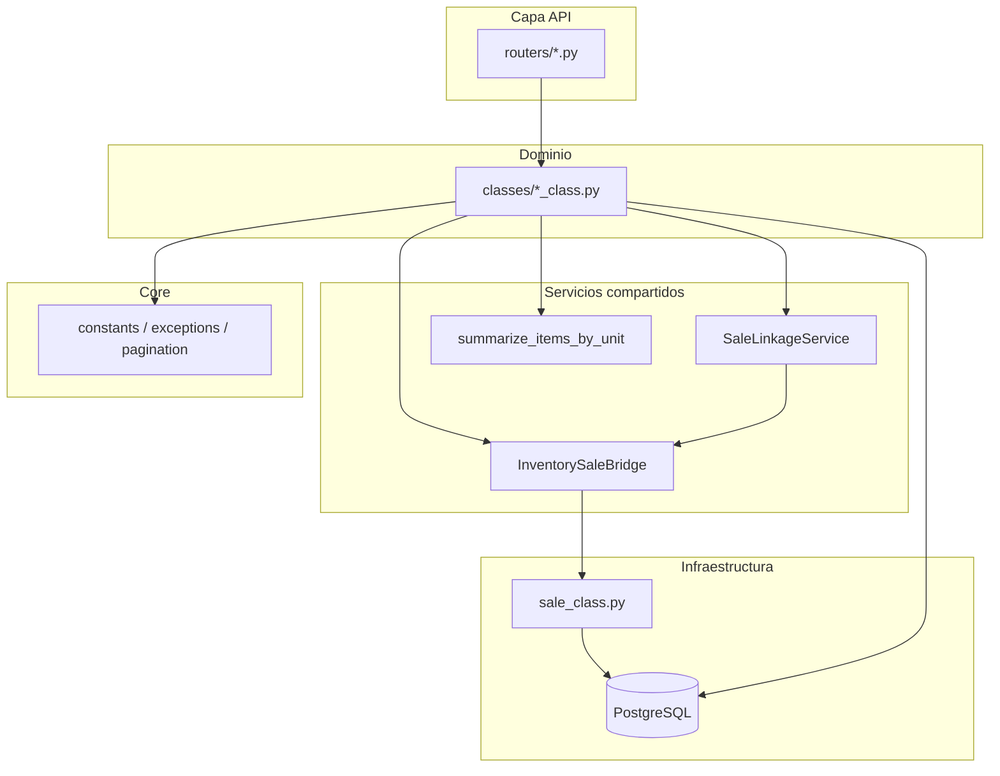

# Arquitectura del backend

ERP FastAPI + SQLAlchemy para La Casa del Vitrificado.

## Diagrama de capas



## Flujo: solicitud → pedido → inventario

Módulos **Muestras**, **Ventas unitarias** y **Uso interno** comparten este flujo:

1. El usuario crea una **solicitud** con líneas de producto.
2. El class valida stock vía `InventorySaleBridge.validate_stock`.
3. `SaleLinkageService.create_or_refresh`:
   - Si ya hay `sale_id`: revierte inventario, actualiza pedido, vuelve a descontar.
   - Si no: crea `SaleModel` (status entregado = 4), asigna `sale_id`.
4. `InventorySaleBridge.deduct_lines` crea movimientos de salida y filas en `sales_products`.

Al **eliminar**:

| Módulo | Inventario | Pedido |
|--------|------------|--------|
| Venta unitaria / Uso interno | Reversa | Borra fila (`hard_delete`) |
| Muestra | Reversa | `status_id = 3` (`soft_reject`) |

## InventorySaleBridge

Ubicación: `services/inventory/inventory_sale_bridge.py`

- `validate_stock` — comprueba disponibilidad por producto.
- `reverse_sale_inventory` — entradas de reversa + limpia `sales_products`.
- `deduct_lines` — salidas FIFO vía `SaleClass._create_consolidated_sale_inventory_exit`.
- `sale_delete_block_reason` / `unlink_sale` — reglas al eliminar pedido.

El `reason_prefix` debe coincidir con `RequestReasonPrefix` (ej. `"Uso interno"`).

## SaleLinkageService

Ubicación: `services/requests/sale_linkage_service.py`

Centraliza creación/actualización de `SaleModel` vinculado. **No valida stock**; el class lo hace antes.

## Constantes (`core/constants.py`)

- `SaleStatus.DELIVERED = 4`, `REJECTED = 3`
- `RequestReasonPrefix` — prefijos en movimientos y dirección de entrega
- `TaxPolicy.UNIT_SALE_RATE = 0.19`, `ZERO` para muestras y uso interno

## Excepciones

- `DomainError` / `ValidationError` en servicios nuevos.
- Classes legacy capturan `(ValueError, ValidationError)` y devuelven dict de error.

## Routers

Patrón actual (mantener):

```python
return {"message": SampleClass(db).get_all(page, ...)}
```

Opcional: decorador `api.map_service_errors` para nuevos endpoints.

## Evolución recomendada

1. Nuevos módulos con el mismo flujo → bridge + linkage desde el día uno.
2. Refactor gradual de `*_class.py` grandes (`sale_class`, `product_class`) extrayendo servicios.
3. Dividir `schemas.py` / `models.py` por dominio cuando crezca el equipo.

## Referencia rápida para agentes IA

**Siempre leer primero:** [`../AGENTS.md`](../AGENTS.md)
